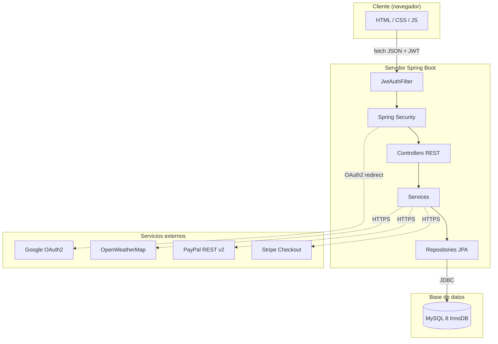
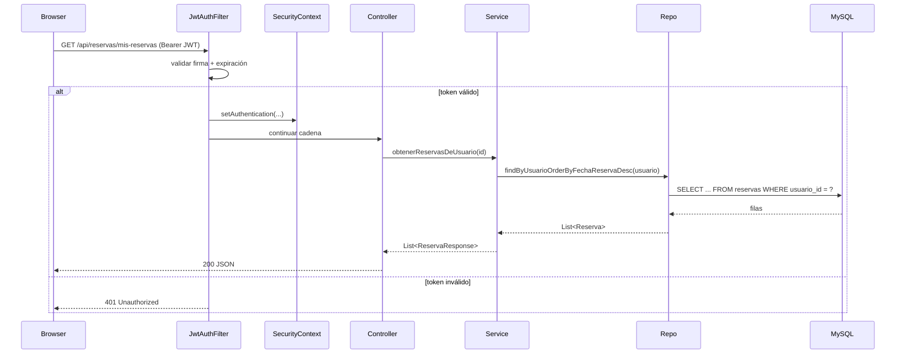
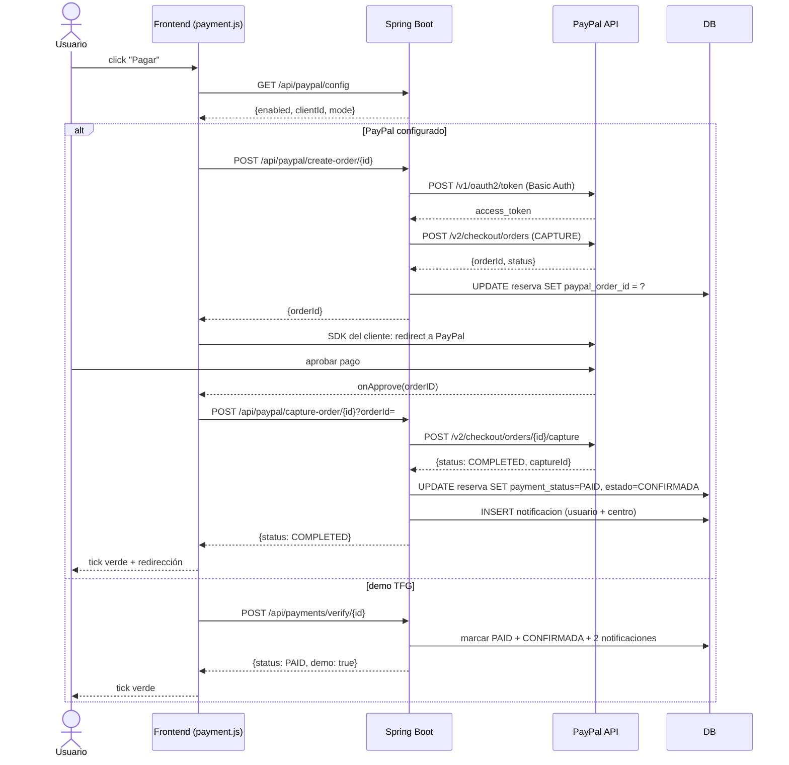
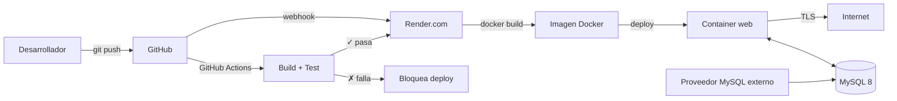

# Arquitectura del sistema

## Visión por capas

```mermaid
flowchart TB
    subgraph Cliente["Cliente (navegador)"]
        UI[HTML / CSS / JS]
    end

    subgraph Servidor["Servidor Spring Boot"]
        direction TB
        Filter[JwtAuthFilter]
        Security[Spring Security]
        Controller[Controllers REST]
        Service[Services]
        Repo[Repositories JPA]
        Filter --> Security
        Security --> Controller
        Controller --> Service
        Service --> Repo
    end

    subgraph BD["Base de datos"]
        MySQL[(MySQL 8 InnoDB)]
    end

    subgraph Externos["Servicios externos"]
        Stripe[Stripe Checkout]
        PayPal[PayPal REST v2]
        Google[Google OAuth2]
        OpenWeather[OpenWeatherMap]
    end

    UI -->|fetch JSON + JWT| Filter
    Repo -->|JDBC| MySQL
    Service -.->|HTTPS| Stripe
    Service -.->|HTTPS| PayPal
    Security -.->|OAuth2 redirect| Google
    Service -.->|HTTPS| OpenWeather
```

## Flujo de petición autenticada

```mermaid
sequenceDiagram
    participant Browser
    participant Filter as JwtAuthFilter
    participant SC as SecurityContext
    participant Controller
    participant Service
    participant Repo
    participant DB as MySQL

    Browser->>Filter: GET /api/reservas/mis-reservas (Bearer JWT)
    Filter->>Filter: validar firma + expiración
    alt token válido
        Filter->>SC: setAuthentication(...)
        Filter->>Controller: continuar cadena
        Controller->>Service: obtenerReservasDeUsuario(id)
        Service->>Repo: findByUsuarioOrderByFechaReservaDesc(usuario)
        Repo->>DB: SELECT ... FROM reservas WHERE usuario_id = ?
        DB-->>Repo: filas
        Repo-->>Service: List<Reserva>
        Service-->>Controller: List<ReservaResponse>
        Controller-->>Browser: 200 JSON
    else token inválido
        Filter-->>Browser: 401 Unauthorized
    end
```

## Flujo del pago

```mermaid
sequenceDiagram
    actor Usuario
    participant Front as Frontend (payment.js)
    participant API as Spring Boot
    participant PP as PayPal API
    participant DB

    Usuario->>Front: click "Pagar"
    Front->>API: GET /api/paypal/config
    API-->>Front: {enabled, clientId, mode}

    alt PayPal configurado
        Front->>API: POST /api/paypal/create-order/{id}
        API->>PP: POST /v1/oauth2/token (Basic Auth)
        PP-->>API: access_token
        API->>PP: POST /v2/checkout/orders (CAPTURE)
        PP-->>API: {orderId, status}
        API->>DB: UPDATE reserva SET paypal_order_id = ?
        API-->>Front: {orderId}
        Front->>PP: SDK del cliente: redirect a PayPal
        Usuario->>PP: aprobar pago
        PP-->>Front: onApprove(orderID)
        Front->>API: POST /api/paypal/capture-order/{id}?orderId=
        API->>PP: POST /v2/checkout/orders/{id}/capture
        PP-->>API: {status: COMPLETED, captureId}
        API->>DB: UPDATE reserva SET payment_status=PAID, estado=CONFIRMADA
        API->>DB: INSERT notificacion (usuario + centro)
        API-->>Front: {status: COMPLETED}
        Front-->>Usuario: tick verde + redirección
    else demo TFG
        Front->>API: POST /api/payments/verify/{id}
        API->>DB: marcar PAID + CONFIRMADA + 2 notificaciones
        API-->>Front: {status: PAID, demo: true}
        Front-->>Usuario: tick verde
    end
```

## Despliegue (Render.com + MySQL externo)

```mermaid
flowchart LR
    Dev[Desarrollador] -->|git push| GitHub
    GitHub -->|webhook| Render[Render.com]
    Render -->|docker build| Image[Imagen Docker]
    Image -->|deploy| App[Container web]
    App -->|TLS| Internet
    MySQLHost[Proveedor MySQL externo] --> MySQL[(MySQL 8)]
    App <--> MySQL

    GitHub -->|GitHub Actions| CI[Build + Test]
    CI -->|✓ pasa| Render
    CI -->|✗ falla| Block[Bloquea deploy]
```
