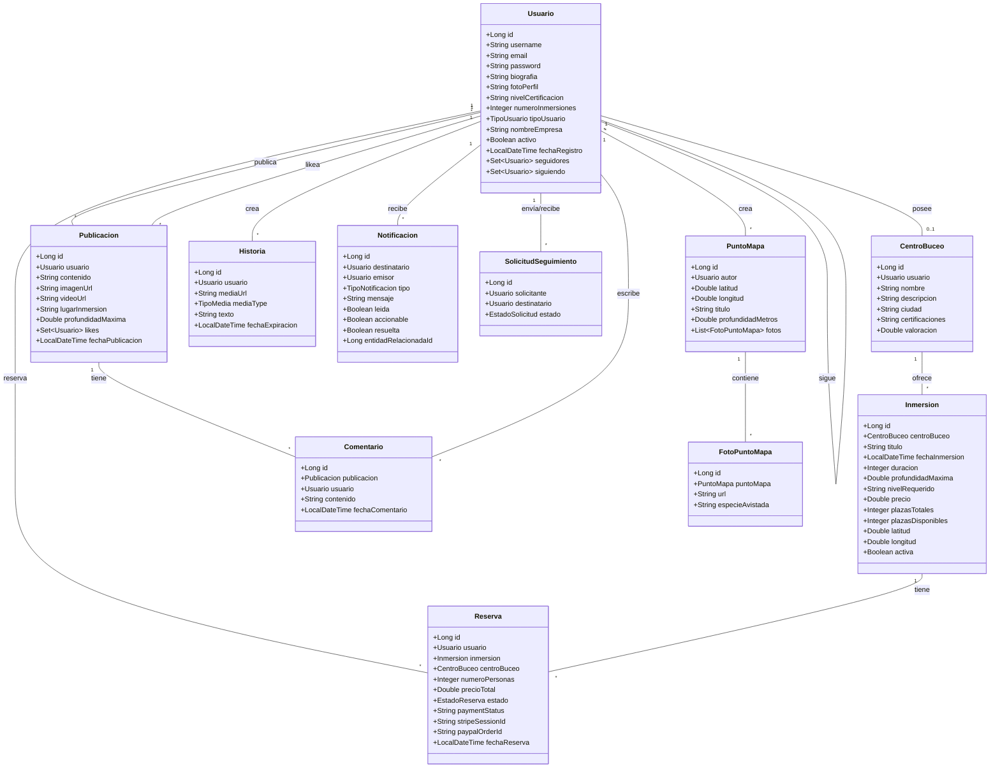
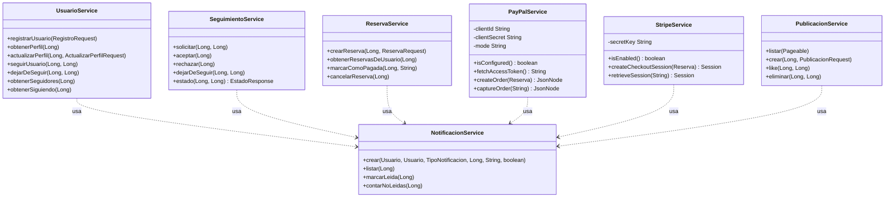
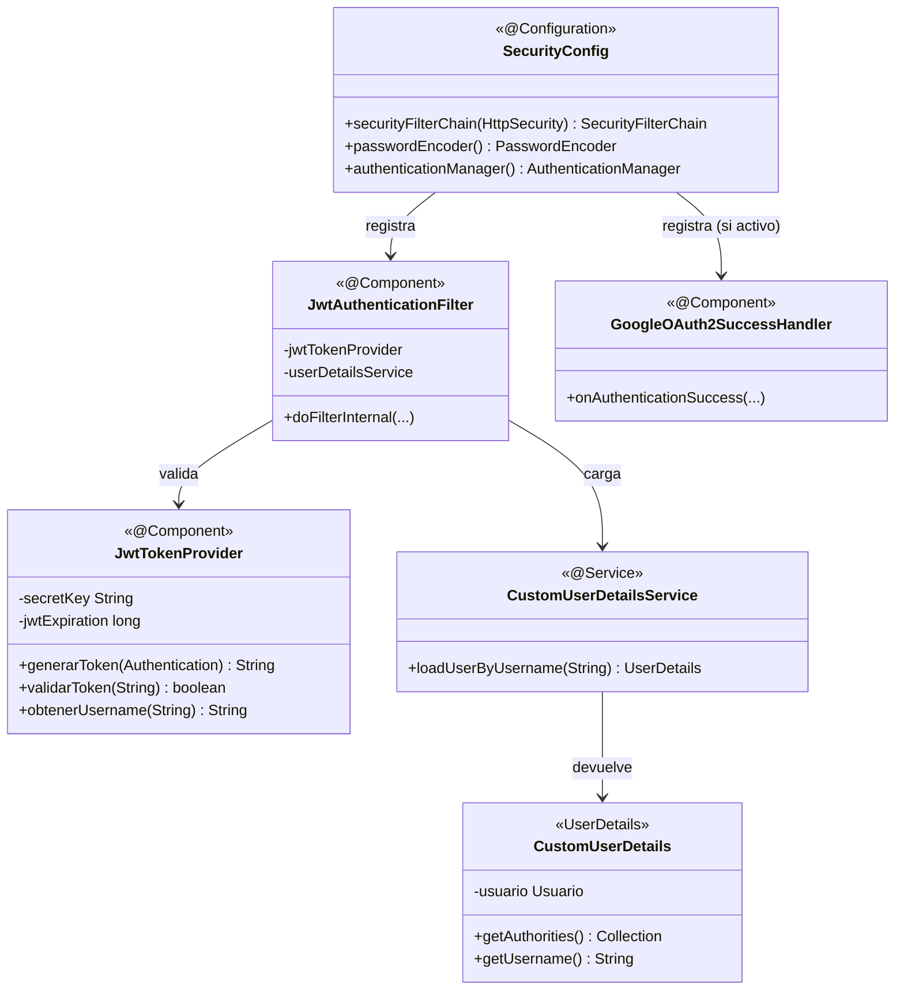

# Diagrama de clases UML

Diagrama de las clases más relevantes del back-end. Renderiza directamente en GitHub gracias a Mermaid.

## Capa de entidades (modelo de dominio)

---

## Capa de servicios (lógica de negocio)

---

## Capa de seguridad

---

## Patrones aplicados

| Patrón | Dónde | Por qué |
|---|---|---|
| **MVC** | controllers/services/repositories | Separación clásica de Spring |
| **Repository** | `UsuarioRepository`, `ReservaRepository`, etc. | Abstrae el acceso a datos |
| **DTO** | `dto/request`, `dto/response` | Aísla la API del modelo de dominio |
| **Strategy** (implícito) | `PaymentController.verificar()` | Decide entre Stripe / demo según configuración |
| **Builder** | `Stripe SessionCreateParams.builder()` | Construcción fluida de objetos complejos |
| **Filter Chain** | `JwtAuthenticationFilter` | Composición de filtros de Spring Security |
| **Singleton** (Spring) | Todos los `@Service`, `@Component` | Por defecto en el contenedor de Spring |
| **Dependency Injection** | Constructor injection con `@RequiredArgsConstructor` | Clarísima la dependencia y facilita test |
