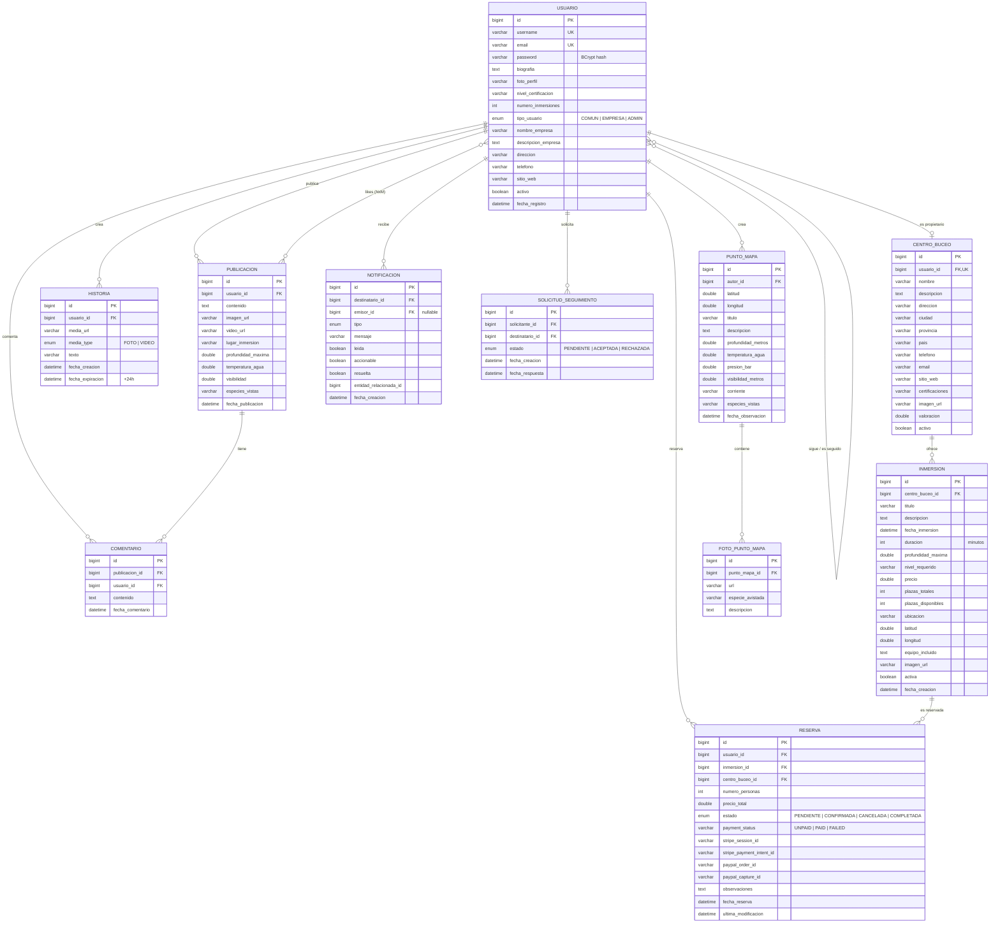

# Modelo Entidad-Relación

Este documento contiene el diagrama E/R de DiveConnect en dos formatos:

1. **Mermaid** (renderiza automáticamente en GitHub).
2. **DBML** para [dbdiagram.io](https://dbdiagram.io) — copia el bloque y pégalo allí para obtener una imagen exportable.

---

## 1. Diagrama Entidad-Relación (Mermaid)



---

## 2. DBML para dbdiagram.io

Copia este bloque en [dbdiagram.io](https://dbdiagram.io/d) para obtener un E/R interactivo y exportable a PNG/PDF/SVG.

```dbml
Project DiveConnect {
  database_type: 'MySQL'
  Note: 'Red social y plataforma de reservas de buceo'
}

Table usuarios {
  id bigint [pk, increment]
  username varchar(50) [unique, not null]
  email varchar(100) [unique, not null]
  password varchar(255) [not null, note: 'BCrypt hash']
  biografia text
  foto_perfil varchar(500)
  nivel_certificacion varchar(50)
  numero_inmersiones int [default: 0]
  tipo_usuario enum('USUARIO_COMUN','USUARIO_EMPRESA','ADMINISTRADOR') [default: 'USUARIO_COMUN']
  nombre_empresa varchar(150)
  descripcion_empresa text
  direccion varchar(255)
  telefono varchar(30)
  sitio_web varchar(255)
  activo boolean [default: true]
  fecha_registro datetime
}

Table seguidores {
  seguidor_id bigint [ref: > usuarios.id]
  seguido_id bigint [ref: > usuarios.id]
  indexes { (seguidor_id, seguido_id) [pk] }
}

Table solicitudes_seguimiento {
  id bigint [pk, increment]
  solicitante_id bigint [ref: > usuarios.id]
  destinatario_id bigint [ref: > usuarios.id]
  estado enum('PENDIENTE','ACEPTADA','RECHAZADA')
  fecha_creacion datetime
  fecha_respuesta datetime
}

Table centros_buceo {
  id bigint [pk, increment]
  usuario_id bigint [unique, ref: - usuarios.id]
  nombre varchar(150) [not null]
  descripcion text
  direccion varchar(255)
  ciudad varchar(100)
  provincia varchar(100)
  pais varchar(100)
  telefono varchar(30)
  email varchar(100)
  sitio_web varchar(255)
  certificaciones varchar(255)
  imagen_url varchar(500)
  valoracion double [default: 0]
  activo boolean [default: true]
}

Table inmersiones {
  id bigint [pk, increment]
  centro_buceo_id bigint [ref: > centros_buceo.id]
  titulo varchar(200) [not null]
  descripcion text
  fecha_inmersion datetime
  duracion int
  profundidad_maxima double
  nivel_requerido varchar(50)
  precio double
  plazas_totales int
  plazas_disponibles int
  ubicacion varchar(200)
  latitud double
  longitud double
  equipo_incluido text
  imagen_url varchar(500)
  activa boolean [default: true]
  fecha_creacion datetime
}

Table reservas {
  id bigint [pk, increment]
  usuario_id bigint [ref: > usuarios.id]
  inmersion_id bigint [ref: > inmersiones.id]
  centro_buceo_id bigint [ref: > centros_buceo.id]
  numero_personas int
  precio_total double
  estado enum('PENDIENTE','CONFIRMADA','CANCELADA','COMPLETADA')
  payment_status varchar(20)
  stripe_session_id varchar(255)
  stripe_payment_intent_id varchar(255)
  paypal_order_id varchar(255)
  paypal_capture_id varchar(255)
  observaciones text
  fecha_reserva datetime
  ultima_modificacion datetime
}

Table publicaciones {
  id bigint [pk, increment]
  usuario_id bigint [ref: > usuarios.id]
  contenido text
  imagen_url varchar(500)
  video_url varchar(500)
  lugar_inmersion varchar(200)
  profundidad_maxima double
  temperatura_agua double
  visibilidad double
  especies_vistas varchar(500)
  fecha_publicacion datetime
}

Table comentarios {
  id bigint [pk, increment]
  publicacion_id bigint [ref: > publicaciones.id]
  usuario_id bigint [ref: > usuarios.id]
  contenido text
  fecha_comentario datetime
}

Table publicacion_likes {
  publicacion_id bigint [ref: > publicaciones.id]
  usuario_id bigint [ref: > usuarios.id]
  indexes { (publicacion_id, usuario_id) [pk] }
}

Table historias {
  id bigint [pk, increment]
  usuario_id bigint [ref: > usuarios.id]
  media_url varchar(500)
  media_type enum('FOTO','VIDEO')
  texto varchar(255)
  fecha_creacion datetime
  fecha_expiracion datetime
}

Table notificaciones {
  id bigint [pk, increment]
  destinatario_id bigint [ref: > usuarios.id]
  emisor_id bigint [ref: > usuarios.id]
  tipo enum('SOLICITUD_SEGUIMIENTO','SEGUIMIENTO_ACEPTADO','SEGUIMIENTO_RECHAZADO','NUEVO_SEGUIDOR','LIKE_PUBLICACION','COMENTARIO_PUBLICACION','RESERVA_CONFIRMADA','RESERVA_RECIBIDA','MENCION')
  mensaje varchar(500)
  leida boolean
  accionable boolean
  resuelta boolean
  entidad_relacionada_id bigint
  fecha_creacion datetime
}

Table puntos_mapa {
  id bigint [pk, increment]
  autor_id bigint [ref: > usuarios.id]
  latitud double
  longitud double
  titulo varchar(200)
  descripcion text
  profundidad_metros double
  temperatura_agua double
  presion_bar double
  visibilidad_metros double
  corriente varchar(50)
  especies_vistas varchar(500)
  fecha_observacion datetime
}

Table fotos_punto_mapa {
  id bigint [pk, increment]
  punto_mapa_id bigint [ref: > puntos_mapa.id]
  url varchar(500)
  especie_avistada varchar(100)
  descripcion text
}
```

---

## 3. Normalización aplicada

El esquema cumple las tres primeras formas normales:

### 1ª Forma Normal (1FN)
Todos los atributos son atómicos. No hay listas embebidas en celdas. Las "especies vistas" se almacenan como cadena separada por comas pero a efectos del modelo se trata como un valor único de texto libre — no es una colección con consultas individualizadas.

### 2ª Forma Normal (2FN)
No hay claves primarias compuestas en tablas con dependencias parciales. Las únicas claves compuestas son las tablas puente (`seguidores`, `publicacion_likes`) cuyos atributos se reducen a la propia clave.

### 3ª Forma Normal (3FN)
No hay dependencias transitivas. Decisión consciente:

- En `reservas` se duplica `centro_buceo_id` aunque sea derivable desde `inmersion_id → inmersion.centro_buceo_id`. Es una **desnormalización deliberada** para acelerar la consulta "reservas recibidas por un centro" sin tener que hacer JOIN. Documentado en la memoria, capítulo 6.
- `usuarios.nombre_empresa` aparece y se duplica en `centros_buceo.nombre`. La razón es histórica: el registro inicial guarda el nombre en `usuarios`, pero el centro tiene su entidad propia con datos extra. Las dos tablas pueden divergir y se asume que `centros_buceo.nombre` es la fuente de verdad cuando existe.

### Boyce-Codd (BCNF)
Tablas no en BCNF estricta: `reservas` (por la desnormalización mencionada). El resto sí.
