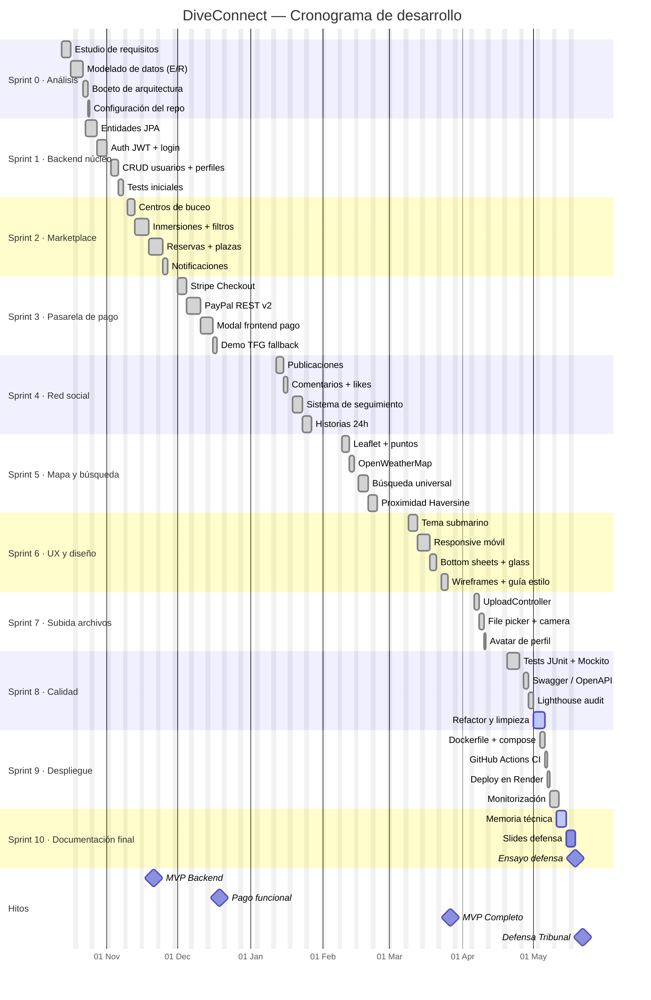

# Cronograma del proyecto (Gantt)

Cronograma real seguido durante el desarrollo de DiveConnect, con sprints semanales y fechas aproximadas en función del histórico de commits del repositorio.

## Sprints en detalle

| Sprint | Foco | Entregables clave | Estado |
|---|---|---|---|
| 0 | Análisis y arranque | E/R, repo Git, README inicial | ✓ |
| 1 | Backend núcleo | Auth, perfiles, base JPA | ✓ |
| 2 | Marketplace | Centros, inmersiones, reservas | ✓ |
| 3 | Pasarela | Stripe + PayPal + demo | ✓ |
| 4 | Red social | Publicaciones, likes, seguimiento | ✓ |
| 5 | Mapa | Leaflet, weather, búsqueda | ✓ |
| 6 | UX | Tema submarino, responsive | ✓ |
| 7 | Subida | UploadController, file picker | ✓ |
| 8 | Calidad | Tests, Swagger, Lighthouse | en curso |
| 9 | Despliegue | Docker, Render, CI/CD | ✓ |
| 10 | Defensa | Memoria final, slides | en curso |

## Hitos cumplidos

- **MVP Backend** (21 nov 2025): API REST completa con auth y CRUD básico.
- **Pago funcional** (19 dic 2025): pasarela end-to-end con Stripe + PayPal + demo.
- **MVP Completo** (27 mar 2026): todas las funcionalidades del scope final.
- **Defensa Tribunal** (22 may 2026): presentación ante tribunal docente.
